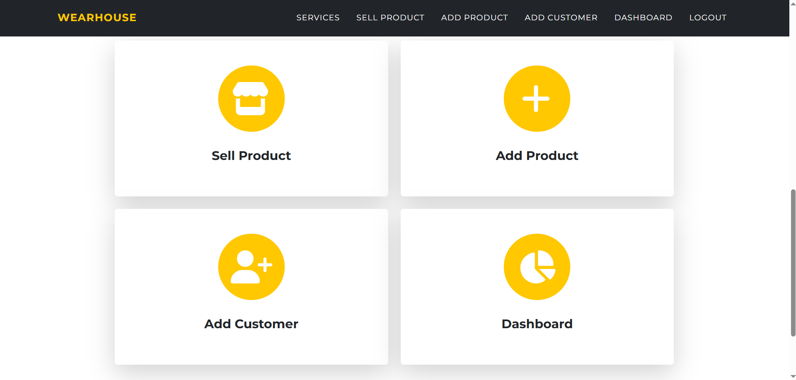
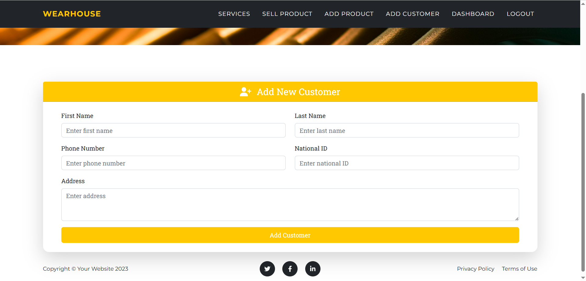
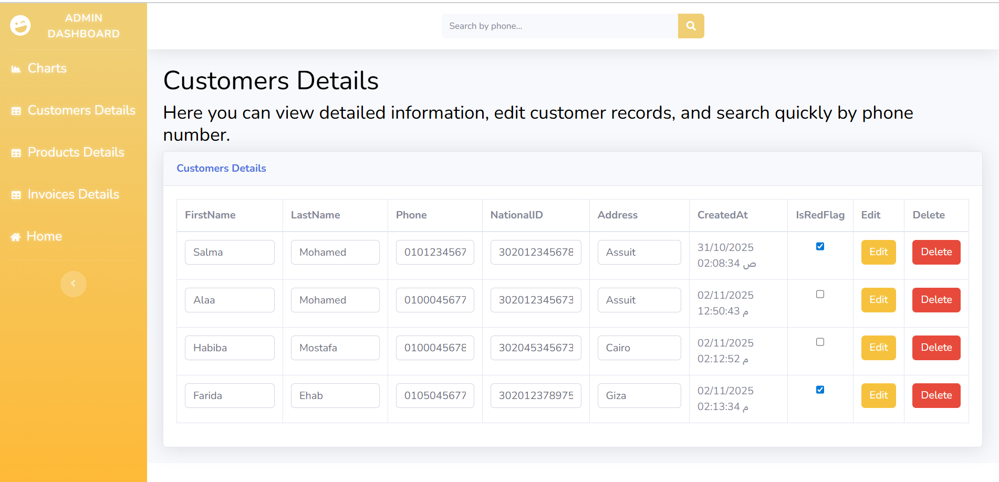

# WearHouse
**Project Overview:**

ASP.NET MVC web app for managing a clothing store’s cashier operations. Features include product management, inventory tracking, sales processing, and invoice generation.

---

  
Key Features

- **User Authentication:** Login & Sign Up system with secure session management.
- **Customer & Product Management:** Efficiently manage records.
- **Sales & Invoicing:** Handle transactions and generate invoices.
- **Admin Dashboard:** View and update all data.
- **Interactive UI:** Responsive using HTML, CSS, JS, Bootstrap.
- **Backend Focused:** Secure and efficient data handling.

 

  
Technologies Used

- **Backend:** ASP.NET Core MVC, Entity Framework Core  
- **Database:** SQL Server  
- **Frontend:** HTML, CSS, JavaScript, Bootstrap  

 

  
Learning Outcomes

- Authentication and authorization
- Database design and management
- Building scalable web apps
- Integrating frontend and backend

 

  
Requirements

   
    To run this project, you need the following software and packages installed:
  
   

  **Development Environment:**  
    - ASP.NET Core Web App (Model-View-Controller)  
    - .NET 8.0  
    - Visual Studio 2022  

  **Database:**  
    - SQL Server Management Studio 2022  

  **NuGet Packages:**  
    - Microsoft.EntityFrameworkCore.SqlServer (version 9.0.10)  
    - Microsoft.EntityFrameworkCore.Tools (version 9.0.10) 

 

  
Screenshots:

<table>
  <tr>
    <th>Login</th>
    <th>Home Page</th>
  </tr>
  <tr>
    <td> </td>
    <td> </td>
  </tr>
</table>

<table>
  <tr>
    <th>Add Customer</th>
    <th>Add Product</th>
  </tr>
  <tr>
    <td> </td>
    <td> </td>
  </tr>
</table>

<table>
  <tr>
    <th>Sell Products</th>
  </tr>
  <tr>
    <td> </td>
  </tr>
</table>

<table>
  <tr>
    <th>Products Dashboard</th>
    <th>Customers Dashboard</th>
    <th>Invoices Dashboard</th>
  </tr>
  <tr>
    <td> </td>
    <td> </td>
    <td> </td>
  </tr>
</table>

<table>
  <tr>
    <th>Invoice Details</th>
  </tr>
  <tr>
    <td> </td>
  </tr>
</table>

<table>
  <tr>
    <th>Chart Details</th>
  </tr>
  <tr>
    <td> </td>
  </tr>
</table>

